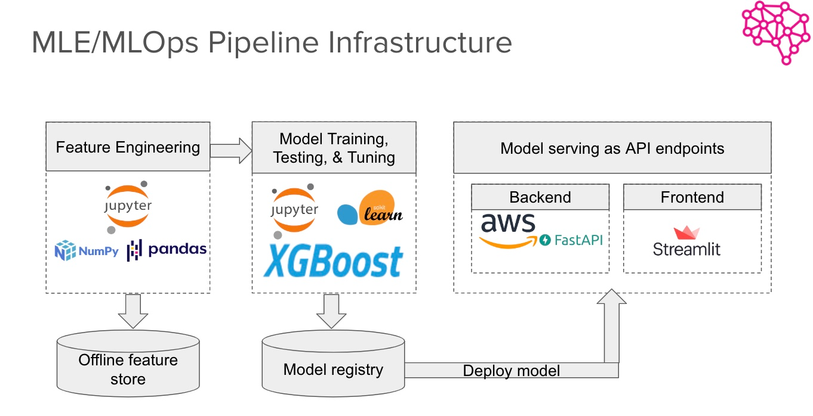

# protein-language-classification

Language of Proteins
Repository for FourthBrain MLE-11 Capstone project

Project Name: Language of Proteins
Team members: Gilles Bouyer, Patrick Gebhard, Chrisogonas Odhiambo

As of February 10th we iterated our models with the following results:

ACP: accuracy: 0.75, precision: 0.74, Recall: 0.76, f1 score: .75. Best model XGBClassifier found with TPOT
AMP: accuracy: 0.83, precision: 0.83, Recall: 0.81, f1 score: .82. Best model XGBClassifier found with TPOT
DNA_Binding: accuracy: 0.63 precision: 0.6, Recall: 0.8, f1 score: .68 Best model GradientBoostingClassifier

baseline_acp.ipynb, baseline_amp.ipynb, baseline_dna.ipynb are the respective notebooks with the models

Protein Sequencing and Classification-2.ipynb explores feature engineering and classification applied to all the 3 classes of proteins. It uses Bag-of-Words to classify protein sequences.

